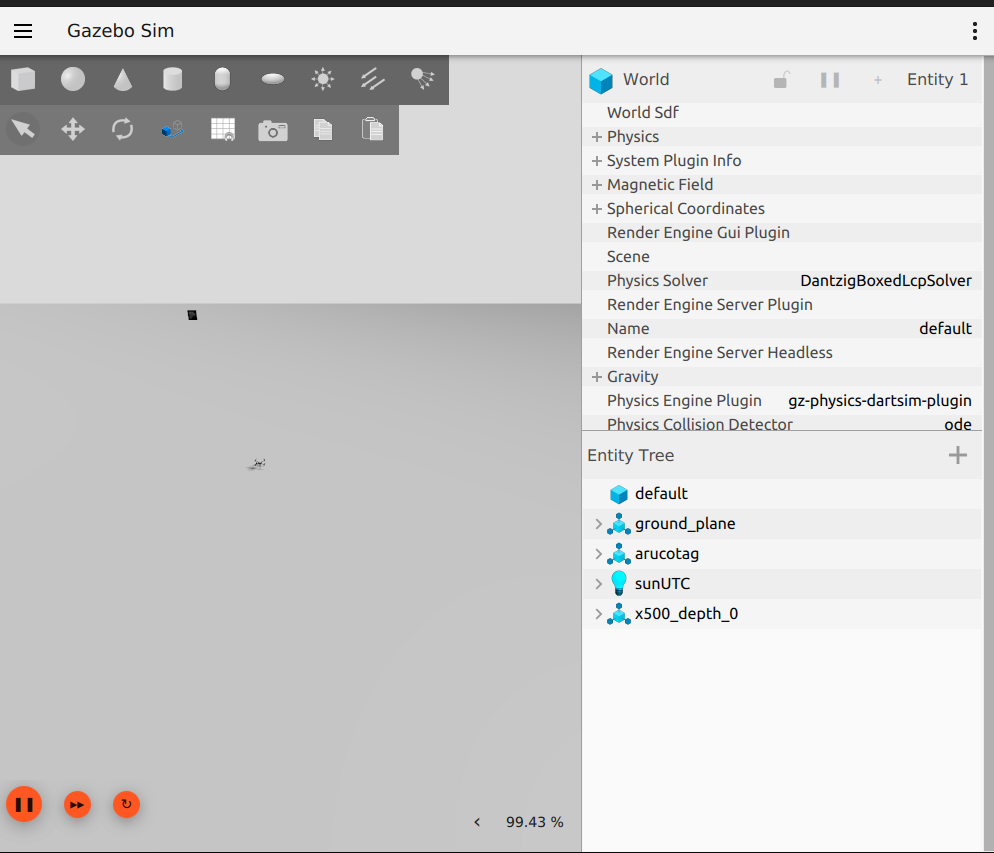
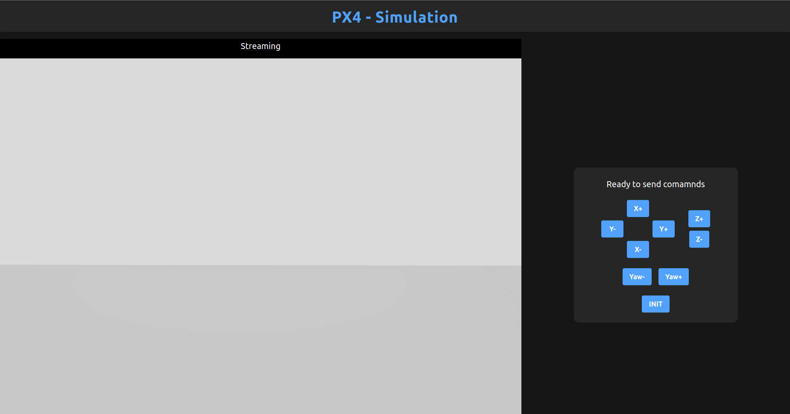
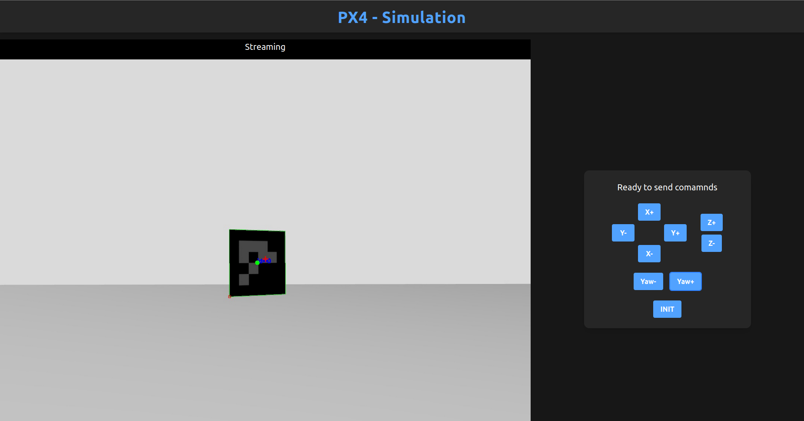

# Dron_pilot - Prueba tecnica

### VIdeo Explicativo

*Video Explicativo* en el siguiente enlace
[video explicativo](https://youtu.be/Dny4c_E0j18)

### Descripción:

Se necesita que un dron regrese de manera autonoma a un punto determinado para cargarse cuando tiene bateria baja, esto se puede hacer referenciando al dorn a un punto y orientarlo, esto se logra mediante la deteccion, aproximacion y centrado a un Aruco. Este trabajo muestra un algoritmo para lograr el objetivo con ayuda de la simualcion de PX4, ROS2 y la implementacion de una interfaz grafica

# Instrucciones para correr el proyecto
### Pre-requisitos:

para correr este proyecto es necesario tener instalado ROS2 Humble, git, python 3.10 o superior y NodeJs

1. *Node.js*: Puedes descargarlo desde el siguiente enlace:
   [Descargar Node.js](https://nodejs.org/en/download/package-manager)

2. *Python 3.10 o superior*: Puedes descargar la versión correcta desde el siguiente enlace:
   [Descargar Python](https://www.python.org/downloads/)

3. *Git*: Asegúrate de tenerlo instalado. Puedes obtenerlo desde el siguiente enlace:
   [Descargar Git](https://git-scm.com/downloads)

4. *Ros Humble*: Debes tener dispositivo con ubuntu 22.04 o alguna distribucion de linux que soporte ROS
    [Descargar ROS2 Humble](https://docs.ros.org/en/humble/Installation.html)

### Instalacion y setup de la simulacion:

Abre una terminal y corre los siguientes comandos para instalar el simulador:

```bash
git clone https://github.com/PX4/PX4-Autopilot.git --recursive
bash ./PX4-Autopilot/Tools/setup/ubuntu.sh
cd PX4-Autopilot/
make px4_sitl
```

Abre otra terminal y corre los siguientes comandos para instalar el agente de comunicacion

```bash
git clone -b v2.4.2 https://github.com/eProsima/Micro-XRCE-DDS-Agent.git
cd Micro-XRCE-DDS-Agent
mkdir build
cd build
cmake ..
make
sudo make install
sudo ldconfig /usr/local/lib/
```

### Nota

Si cuando corres el comando "make" ves un error asi: 

```bash
CMake Error at /home/eduardo/Micro-XRCE-DDS-Agent/build/fastdds/tmp/fastdds-gitclone.cmake:40 (message): Failed to checkout tag: '2.12.x'
```

Para solucionar el error ve a la carpeta de "~/Micro-XRCE-DDS-Agent" y modifica la linea 99 del CMakeLists.txt a:

```bash
set(_fastdds_tag 2.12.1)
```

Guardalo y vuelve a intentarlo

En otra terminal corre los siguinetes comandos para configurar el QGroundControl necesario para la simualcion

```bash
sudo usermod -a -G dialout $USER
sudo apt-get remove modemmanager -y
sudo apt install gstreamer1.0-plugins-bad gstreamer1.0-libav gstreamer1.0-gl -y
sudo apt install libfuse2 -y
sudo apt install libxcb-xinerama0 libxkbcommon-x11-0 libxcb-cursor-dev -y
```

Despues instala la siguiente imagen:

*Download*:
   [QGroundControl.AppImage](https://d176tv9ibo4jno.cloudfront.net/latest/QGroundControl.AppImage)

Probablemente se descargo en la carpeta Downloads, por lo que dirijete a esa carpera o a la carpeta donde se haya guardado la descarga y dale permisos de ejecucion

```bash
cd ./Downloads
chmod +x ./QGroundControl.AppImage
```

Instala el bridge de gazebo con ROS y otras dependencias

```bash
pip install mavsdk
pip install aioconsole
pip install pygame
sudo apt install ros-humble-ros-gzgarden
pip install numpy
pip install "numpy<2.0"
pip install opencv-python
```

### Modificacion de mundo Gazebo

dirigete a la carpeta de tu simulacion donde estan guardados los mundos, en la siguiente ruta: 

```bash
cd ~/PX4-Autopilot/Tools/simulation/gz/worlds
```

despues modifica el archivo llamado default.sdf añadiendo la siguientes lineas antes de cerrar la etiqueta </world>

```bash
<include>
  <uri>model://arucotag</uri>
  <pose>12 5.5 5 0 -1.5708 0</pose>
</include>
```

como se nota en la siguiente imagen:


## Instalacion de paquete de ROS

Ahora creamos un workspace para trabajar con ROS

En una nueva terminal corre el siguiente comando para crear el Workspace:

```bash
mkdir -p ws_px4/src
```

una vez creada metete a la carpeta src:

```bash
cd ./ws_px4/src
```

dentro de la carpeta copia el repositorio del paquete:

```bash
git clone https://github.com/eduardohufg/dron_pilot
```

tambien clona el paquete de mandajes de comunicacion del dron

```bash
git clone https://github.com/PX4/px4_msgs.git
```

regresa a la carpeta raiz del workspace y compila

```bash
cd ..
colcon build
```

## Inicializacion de simulacion

puedes cerrar todas las terminales y empezar desde aqui o dirijete a las rutas mencionadas.

Abre una terminal y e a la carpeta donde descargaste QGroundControl y ejecutalo

```bash
cd ./Downloads
 ./QGroundControl.AppImage 
```

Abre otra terminal y ejecuta el agente de comunicacion

```bash
cd Micro-XRCE-DDS-Agent/
MicroXRCEAgent udp4 -p 8888
```

En otra terminal corre la simulacion

```bash
cd PX4-Autopilot/
make px4_sitl gz_x500_depth
```

deberias ver algo asi:



En otro terminal dirijete al workspace de ROS y ve al siguiente directorio

```bash
cd ws_px4/src/dron_pilot
```

En esta ruta crea y activa un entorno virtual que nos servira para instalar las dependencias

```bash
python3 -m venv .venv
source venv/bin/activate
```

Una vez activado corre el siguiente comando en esa ruta para descargar las dependencias:

```bash
pip install -r requirements.txt
```

Despues regresa a la raiz de worksape y haz un source del entorno:

```bash
cd ../..
source install/setup.bash
```

Corre el paquete:

```bash
ros2 launch dron_pilot dron_controller_launch.py
```

Para poder correr la interfaz wed abre una terminal y dirigete a la siguiente ruta:

```bash
cd ws_px4/src/dron_pilot/app
```

Instala las dependenciad de node y corre el programa:

```bash
npm install
npm run dev
```

Despues abre un navegador y dirigete a la ruta que de indico: 

```bash
http://localhost:5173/
```

Deberiad ver algo como lo siguiente:



Y listo!! con los botones puedes teleoperar al dron y si presionas el boton de INIT empieza con la busqueda y localizacion del auruco:





